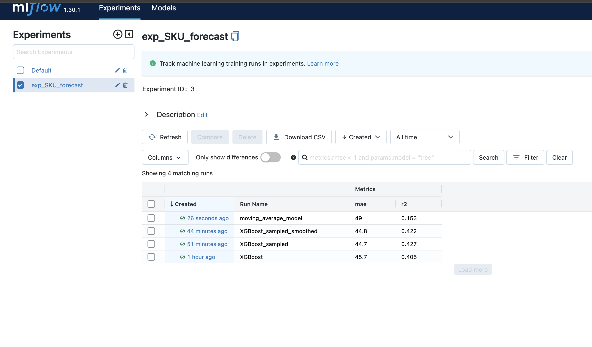

# SKU Sales Data Analysis and Preprocessing

## Introduction
This project focuses on analyzing and forecasting the sales of different Stock Keeping Units (SKUs) over time. With a diverse range of SKUs sold on different dates, our goal is to predict the quantity that will be sold over a given period (lead time) for each SKU.
This will help optimize the inventory planning

## EDA Summary
In the EDA notebook, we try to do a full understanding of the data to get a better grasp of the problematic
- **Data Overview**: The dataset ranges from October 2015 to May 2024, with over 1 million entries, covering sales information for 3,835 unique SKUs all sold in the same store
- **Sales Distribution**: Approximately 10% of SKUs were sold fewer than five times, indicating many items had limited sales activity. 
- **Temporal Trends**: Both the number of unique SKUs and the total quantity sold showed an increasing trend over time. some seasonal patterns were observed, with peaks in sales during summer and November, possibly due to Black Friday and holiday shopping.
- **Anomalies and Outliers**: There were extreme sales values, especially in recent years. the absence of sales at the end of 2016 suggested the store might have been closed during this period.

# Modelling Phase
## Model goals
- The goal of our model is to help the optimization of our inventory planning so we want to build an algorithm that is capable to predict at any point of time the sum of the product that we are going to sell over the coming **LEAD_TIME** period
- Compared to other SKUs forecasting problem with fixed number of SKUs, we find ourself facing a growing business with changing number of SKUs so we have to build a model adapted to that need
## Preprocessing Summary
The preprocessing file is in scripts/preprocess.py
To preprocess the data, run the following command:

The preprocessing includes 3 main steps:
- **Filtering**: Data before 2017 was excluded due to anomalies from store closures. SKUs with fewer than 30 total appearances over the last 2 years were filtered out.
The preprocessing steps include filter
- **Restructuring**: To transform the problem into a time series problem, We construct our range of dates and follow the sales of all the selected SKUs over these dates 
- **Feature Engineering**: We extract time features based on the the lags, the moving average, the week/month, the sales of last year and the global performance of the store
- **Train/test split**: We use a temporal split to mimic the condition of usage of our algorithm. We want our test set to include different seasons so we verify that we perform good all over the year.

## Modelling approach:
### Evaluation
- As we don't know the store inventory planning strategy, we want our algorithm to perform on daily basis and thus we are going to calculate the loss over each day of the test set (last year)
- We define two metrics, mean absolute error and the r2 between our prediction and the target
### Experiment tracking:
- We use **MLFLOW** to track our experiments performance as well as for our hyperparameters optimization
### Hyperparameter optimization
- We use optuna to optimize the hyperparameters of xgboost
### Models
- **Moving average**: This will serve as a benchmark, we calculate the moving average the quantity sold by SKU over the last 15 days and multiply it by the **LEAD TIME**
- **Xgboost**:
  - Xgboost on raw data: This performs better than the benchmark but we suffer from overfitting and long training time because of the scarcity of the data
  - Xgboost on sampled data: We sample from the data that hasn't been sold over the last month.This performs better and suffer less from overfitting but we observe too much noise in the prediction as xgboost treats every date as an independent from others
  - Xgboost on sampled data and smoothing: We apply exponential moving average smoothing, this doesn't improve the metrics but allow the product to better suit the logic of the business
### comparaison of performance

### explainability:
- We use shap values to help us understand the impact of the different features
### final model
  - We use the Xgboost on sampled data  and implement it in scripts/train.py
To execute the training, run the following command


# Potential improvements
- One main improvement depends on the comprehension of the problem, this is related to the business and how do they intend to use the model, this can help us improve major choices in our modelling approach as the choice of the target variable, the choice of SKUs to focus on, and the choice of the loss function of the model.
- The whole approach suppose that all SKUs are equal, in real life SKUs has different prices and different impact on business
- All our approach is based on time features and global performance of the store, We can this of clustering the SKUs into different categories and use this to better predict sales, we can think of including other datasets that could impact the sales based on external or internal factors of the business
- We overlooked approaches based on deep learning as lstm or calculating the correlation matrixes between SKUs as both of these method requires a fixed number of SKUs and recreating the model each time the business sells a new type of item, the xgboost based only a temporal features offer us flexibility on this side.
- In the training, we consider a batch of selected hyperparameters, we could think of automating the hyperparameters optimization to fit with new data

# Exectuion
In the terminal, you can execute :
```sh
sh program.sh
```
which will:
- create a virtual environment
- install the requirements
- execute the preprocessing and save the output in the path that you choose
- execute the training and save the model as well as the metrics
PS: Add the data to the repo or change the path in the sh file
